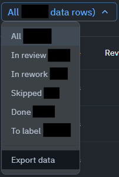
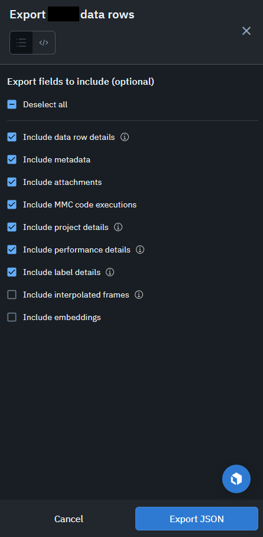

# Labelbox dashboard
Dashboard to visualize data from Labelbox projects using LEFO labeling schema. Works on BCI, TBS and Quebec projects currently.

# How to Export Data from a Project

1. **Navigate to the Data Rows Tab**  
    In your Labelbox project, open the *Data Rows* tab.

2. **Select Data to Export**  
    Choose *All* data rows, or select only the specific rows you wish to export. Click on *Export data*.

     

3. **Configure Export Fields**  
    Ensure all relevant fields are included in the export. You may exclude *interpolated frames* and *embeddings*, as these are not used in the dashboard and can slow down the export process.

     

4. **Download the Exported File**  
    Go to the *Notifications* tab and download the latest export file once it is ready.

# How to Import Data into the Dashboard

1. **Navigate to the Dashboard**  
    Open the [dashboard](https://lefolab-labelbox-dashboard.streamlit.app/).

2. **Upload the Exported File**  
    Click on the *Browse files* button and select the exported file from your Labelbox project.
    You can also drag and drop the file into the designated area.
    Multiple files can be uploaded at once, and the dashboard will automatically merge them.
